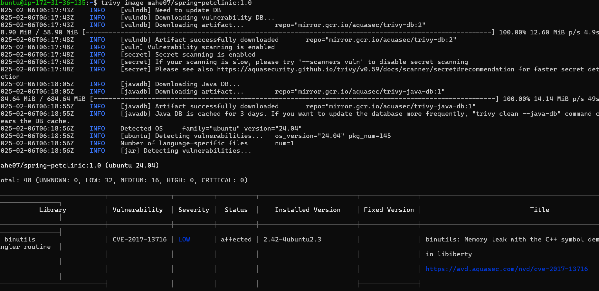
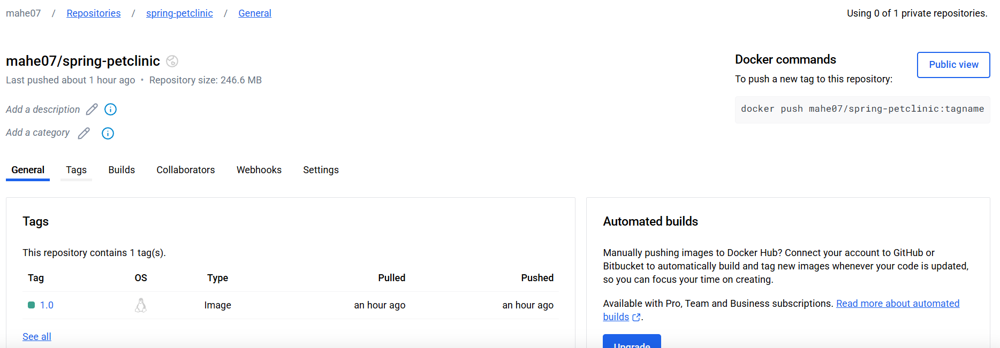

## This file is all about how to create a image, how to run container and scan an image with Trivy scan tool

* launch an ec2 instance 
   * install Docker init

    - `curl -fsSL https://get.docker.com -o get-docker.sh`
    - `sh get-docker.sh`
   * After docker installation it will creates the group called docker
   * Add user to the group called docker
     `sudo usermod -aG docker ubuntu`
   * Now exit and login
     
      * Here client(CLI) and server(Docker Engine) is connected
## Now write a Multi staged Dockerfile for SpringPetclinic
   **Requirements**
     * maven 
     * jdk-17
```bash 
FROM maven:3.9-eclipse-temurin-17-alpine AS build
# copy all code . to spc
COPY . /spc
# Make spc as a working directory
WORKDIR /spc
# Run command for jar file
RUN mvn package

FROM eclipse-temurin:17
LABEL project="learning"
LABEL author="mahe"
#Create an Argument called USERNAME and give any username
ARG USERNAME=nonroot
# Add a non_root user and directory
RUN useradd -r -m -d /apps/${USERNAME} -s /bin/bash ${USERNAME}
#change root user to non_root user
USER ${USERNAME}
# copy jar file from build stage and copy to /apps
COPY --from=build --chown=${USERNAME}:${USERNAME}  /spc/target/spring-petclinic-3.4.0-SNAPSHOT.jar /apps/spring-petclinic-3.4.0-SNAPSHOT.jar
# make working directory apps
WORKDIR /apps
# SpringPetclinc application will runs on port 8080
EXPOSE 8080
# CMD Executes when the container is started
CMD [ "java", "-jar", "spring-petclinic-3.4.0-SNAPSHOT.jar" ]
```
# Now create an Image

docker image build -t <imagename:version>
```bash
docker image build -t spc:1.0
# to see all images run
docker image ls
```
# Now create Container
  - to run the container there are two options
     * Attached mode
     * Detached Mode (-d)

docker container run --name <container name> <imagename>
```bash
docker run --name spc1 spc:1.0 (Attached mode(this will displays the content in terminal))
docker run -d --name spc1 spc:1.0 (Detached mode)

# PortForwarding
  two options 
  * 1. -p (- small p) we should known which port is avaliable
  * 2. -P (- captial P) docker will assign the port to container for access the applincation in browser
```bash
docker run -d -p 80:8080 --name spc1 spc:1.0 (http://hostip:80)
docker run -d -P --name spc1 spc:1.0 (http://hostip:<portnumber>)
```

# How to commuicate into containers
  * Two Options 
     * 1.while creating container `docker run -it spc:1.0 /bin/bash`
     * 2. After Creation (docker exec <Container Name> <Any Command>)
            `docker exec spc1 printenv`


## Now scan the Image using Trivy Scanner tool
* Install Trivy on Ubuntu 24.04
 ```bash
 sudo apt-get install wget apt-transport-https gnupg
wget -qO - https://aquasecurity.github.io/trivy-repo/deb/public.key | gpg --dearmor | sudo tee /usr/share/keyrings/trivy.gpg > /dev/null
echo "deb [signed-by=/usr/share/keyrings/trivy.gpg] https://aquasecurity.github.io/trivy-repo/deb generic main" | sudo tee -a /etc/apt/sources.list.d/trivy.list
sudo apt-get update
sudo apt-get install trivy
```
* Command for image scan(trivy image <imagename>)
`trivy image spc:1.0`


## Now Push image to Docker hub
 * Step:1 docker login (it will redirect to new tab in browser (give login crediantials))
 * step:2 Create a Registory in docker hub
 # now push the image from local to docker hub 
   docker push (<username>/<reponame>:<tag>)
 `docker push mahe07/spring-petclinic:1.0`
 * Note: if image name is not like this plz rename the image name(`docker tag spc:1.0 mahe07/spring-petclinic:1.0`)


* if you want pull image
```bash
 docker pull mahe07/spring-petclinic:1.0
 docker run -d -P mahe07/spring-petclinic:1.0
```
 


    
     